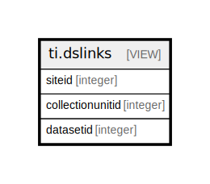

# ti.dslinks

## Description

<details>
<summary><strong>Table Definition</strong></summary>

```sql
CREATE VIEW dslinks AS (
 SELECT sites.siteid,
    collectionunits.collectionunitid,
    datasets.datasetid
   FROM ((ndb.sites
     JOIN ndb.collectionunits ON ((sites.siteid = collectionunits.siteid)))
     JOIN ndb.datasets ON ((collectionunits.collectionunitid = datasets.collectionunitid)))
)
```

</details>

## Columns

| # | Name             | Type    | Default | Nullable | Children | Parents | Comment |
| - | ---------------- | ------- | ------- | -------- | -------- | ------- | ------- |
| 1 | collectionunitid | integer |         | true     |          |         |         |
| 2 | datasetid        | integer |         | true     |          |         |         |
| 3 | siteid           | integer |         | true     |          |         |         |

## Referenced Tables

| # | # | Name                                          | Columns | Comment                                                                                                                                                                                                                                                                                                                                                                                                                                                                                                                                                                                                                                                                                                                                                                                                                                                                                | Type       |
| - | - | --------------------------------------------- | ------- | -------------------------------------------------------------------------------------------------------------------------------------------------------------------------------------------------------------------------------------------------------------------------------------------------------------------------------------------------------------------------------------------------------------------------------------------------------------------------------------------------------------------------------------------------------------------------------------------------------------------------------------------------------------------------------------------------------------------------------------------------------------------------------------------------------------------------------------------------------------------------------------- | ---------- |
| 1 | 1 | [ndb.sites](ndb.sites.md)                     | 13      | The Sites table stores information about sites or localities, including name, geographic coordinates, and description. Sites generally have an areal extent and can be circumscribed by a latitude-longitude box. However, site data ingested from legacy databases have included only point locations. The lat-long box can be used either to circumscribe the aerial extent of a site or to provide purposeful imprecision to the site location. Site location may be imprecise because the original description was vague, e.g. «a gravel bar 5 miles east of town», or because the investigators, land owner, or land management agency may not want the exact location made public, perhaps to prevent looting and vandalism. In the first case, the lat-long box can be made sufficiently large to encompass the true location and in the second case to prevent exact location. | BASE TABLE |
| 2 | 2 | [ndb.collectionunits](ndb.collectionunits.md) | 20      | This table stores data for Collection Units.                                                                                                                                                                                                                                                                                                                                                                                                                                                                                                                                                                                                                                                                                                                                                                                                                                           | BASE TABLE |
| 3 | 3 | [ndb.datasets](ndb.datasets.md)               | 8       | This table stores the data for Datasets. A Dataset is the set of samples for a particular data type from a Collection Unit. A Collection Unit may have multiple Datasets for different data types, for example one dataset for pollen and another for plant macrofossils. Every Sample is assigned to a Dataset, and every Dataset is assigned to a Collection Unit. Samples from different Collection Units cannot be assigned to the same Dataset (although they may be assigned to Aggregate Datasets).                                                                                                                                                                                                                                                                                                                                                                             | BASE TABLE |

## Relations



---

> Generated by [tbls](https://github.com/k1LoW/tbls)