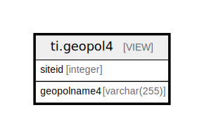

# ti.geopol4

## Description

<details>
<summary><strong>Table Definition</strong></summary>

```sql
CREATE VIEW geopol4 AS (
 SELECT sites.siteid,
    geopoliticalunits.geopoliticalname AS geopolname4
   FROM (ndb.sites
     JOIN (ndb.geopoliticalunits
     JOIN ndb.sitegeopolitical ON ((geopoliticalunits.geopoliticalid = sitegeopolitical.geopoliticalid))) ON ((sites.siteid = sitegeopolitical.siteid)))
  WHERE (geopoliticalunits.rank = 4)
)
```

</details>

## Columns

| # | Name        | Type         | Default | Nullable | Children | Parents | Comment |
| - | ----------- | ------------ | ------- | -------- | -------- | ------- | ------- |
| 1 | siteid      | integer      |         | true     |          |         |         |
| 2 | geopolname4 | varchar(255) |         | true     |          |         |         |

## Referenced Tables

| # | # | Name                                              | Columns | Comment                                                                                                                                                                                                                                                                                                                                                                                                                                                                                                                                                                                                                                                                                                                                                                                                                                                                                                                                                                                                                                                                                                                                                                                                                                                                                                                                                                                                                                                                                                                                                                                        | Type       |
| - | - | ------------------------------------------------- | ------- | ---------------------------------------------------------------------------------------------------------------------------------------------------------------------------------------------------------------------------------------------------------------------------------------------------------------------------------------------------------------------------------------------------------------------------------------------------------------------------------------------------------------------------------------------------------------------------------------------------------------------------------------------------------------------------------------------------------------------------------------------------------------------------------------------------------------------------------------------------------------------------------------------------------------------------------------------------------------------------------------------------------------------------------------------------------------------------------------------------------------------------------------------------------------------------------------------------------------------------------------------------------------------------------------------------------------------------------------------------------------------------------------------------------------------------------------------------------------------------------------------------------------------------------------------------------------------------------------------- | ---------- |
| 1 | 1 | [ndb.sites](ndb.sites.md)                         | 13      | The Sites table stores information about sites or localities, including name, geographic coordinates, and description. Sites generally have an areal extent and can be circumscribed by a latitude-longitude box. However, site data ingested from legacy databases have included only point locations. The lat-long box can be used either to circumscribe the aerial extent of a site or to provide purposeful imprecision to the site location. Site location may be imprecise because the original description was vague, e.g. «a gravel bar 5 miles east of town», or because the investigators, land owner, or land management agency may not want the exact location made public, perhaps to prevent looting and vandalism. In the first case, the lat-long box can be made sufficiently large to encompass the true location and in the second case to prevent exact location.                                                                                                                                                                                                                                                                                                                                                                                                                                                                                                                                                                                                                                                                                                         | BASE TABLE |
| 2 | 2 | [ndb.geopoliticalunits](ndb.geopoliticalunits.md) | 7       | Lookup table of GeoPoliticalUnits. Table is referenced by the SiteGeoPolitical table. These are countries and various subdivisions. Countries and subdivisions were acquired from the U.S. Central Intelligence Agency World Factbook8 and the ISO 3166-1 and ISO 3166-2 databases9.<br>Each GeoPolitical Unit has a rank. GeoPolitical Units with Rank 1 are generally countries. There are a few exceptions, including Antarctica and island territories, such as Greenland, which although a Danish territory, is geographically separate and distinct. Rank 2 units are generally secondary political divisions with various designations: e.g. states in the United States, provinces in Canada, and regions in France. For some countries, the secondary divisions are not political but rather distinct geographic entities, such as islands. The secondary divisions of some island nations include either groups of islands or sections of more highly populated islands; however, the actual island on which a site is located is more important information. Some countries also have Rank 3 units, e.g. counties in the United States and metropolitan departments in France. In addition to purely political units, various other administrative regions and geographic entities can be contained in this table. Examples of administrative regions are National Parks and Forests. It might be quite useful, for example, to have a record of all the sites in Yellowstone National Park. These additional units are Rank 4, and they can be added to the database as warranted. | BASE TABLE |
| 3 | 3 | [ndb.sitegeopolitical](ndb.sitegeopolitical.md)   | 6       | This table lists the GeoPolitical units in which sites occur.                                                                                                                                                                                                                                                                                                                                                                                                                                                                                                                                                                                                                                                                                                                                                                                                                                                                                                                                                                                                                                                                                                                                                                                                                                                                                                                                                                                                                                                                                                                                  | BASE TABLE |

## Relations



---

> Generated by [tbls](https://github.com/k1LoW/tbls)