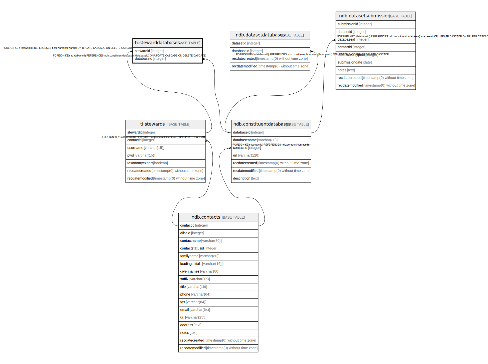

# ti.stewarddatabases

## Description

## Columns

| # | Name       | Type    | Default | Nullable | Children | Parents                                                 | Comment |
| - | ---------- | ------- | ------- | -------- | -------- | ------------------------------------------------------- | ------- |
| 1 | stewardid  | integer |         | false    |          | [ti.stewards](ti.stewards.md)                           |         |
| 2 | databaseid | integer |         | false    |          | [ndb.constituentdatabases](ndb.constituentdatabases.md) |         |

## Constraints

| # | Name                                     | Type        | Definition                                                                                                   |
| - | ---------------------------------------- | ----------- | ------------------------------------------------------------------------------------------------------------ |
| 1 | fk_stewarddatabases_constituentdatabases | FOREIGN KEY | FOREIGN KEY (databaseid) REFERENCES ndb.constituentdatabases(databaseid) ON UPDATE CASCADE ON DELETE CASCADE |
| 2 | stewarddatabases_pkey                    | PRIMARY KEY | PRIMARY KEY (stewardid, databaseid)                                                                          |
| 3 | fk_stewarddatabases_stewards             | FOREIGN KEY | FOREIGN KEY (stewardid) REFERENCES ti.stewards(stewardid) ON UPDATE CASCADE ON DELETE CASCADE                |

## Indexes

| # | Name                  | Definition                                                                                           |
| - | --------------------- | ---------------------------------------------------------------------------------------------------- |
| 1 | stewarddatabases_pkey | CREATE UNIQUE INDEX stewarddatabases_pkey ON ti.stewarddatabases USING btree (stewardid, databaseid) |

## Relations

---

> Generated by [tbls](https://github.com/k1LoW/tbls)