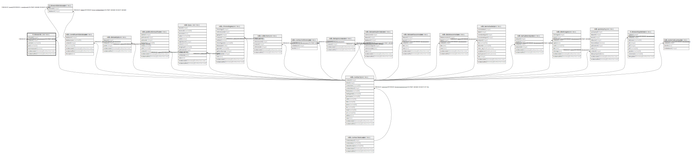

# ti.stewards

## Description

## Columns

| # | Name            | Type                           | Default                               | Nullable | Children                                      | Parents                         | Comment |
| - | --------------- | ------------------------------ | ------------------------------------- | -------- | --------------------------------------------- | ------------------------------- | ------- |
| 1 | stewardid       | integer                        | nextval('ti.stewardid_seq'::regclass) | false    | [ti.stewarddatabases](ti.stewarddatabases.md) |                                 |         |
| 2 | contactid       | integer                        |                                       | false    |                                               | [ndb.contacts](ndb.contacts.md) |         |
| 3 | username        | varchar(15)                    |                                       | false    |                                               |                                 |         |
| 4 | pwd             | varchar(15)                    |                                       | false    |                                               |                                 |         |
| 5 | taxonomyexpert  | boolean                        |                                       | false    |                                               |                                 |         |
| 6 | recdatecreated  | timestamp(0) without time zone |                                       | true     |                                               |                                 |         |
| 7 | recdatemodified | timestamp(0) without time zone |                                       | true     |                                               |                                 |         |

## Constraints

| # | Name                 | Type        | Definition                                                                   |
| - | -------------------- | ----------- | ---------------------------------------------------------------------------- |
| 1 | fk_stewards_contacts | FOREIGN KEY | FOREIGN KEY (contactid) REFERENCES ndb.contacts(contactid) ON UPDATE CASCADE |
| 2 | stewards_pkey        | PRIMARY KEY | PRIMARY KEY (stewardid)                                                      |

## Indexes

| # | Name          | Definition                                                               |
| - | ------------- | ------------------------------------------------------------------------ |
| 1 | stewards_pkey | CREATE UNIQUE INDEX stewards_pkey ON ti.stewards USING btree (stewardid) |

## Triggers

| # | Name          | Definition                                                                                                                    |
| - | ------------- | ----------------------------------------------------------------------------------------------------------------------------- |
| 1 | record_update | CREATE TRIGGER record_update BEFORE INSERT OR UPDATE ON ti.stewards FOR EACH ROW EXECUTE FUNCTION ti.update_recdatemodified() |
| 2 | recordcreated | CREATE TRIGGER recordcreated BEFORE INSERT ON ti.stewards FOR EACH ROW EXECUTE FUNCTION ti.reccreate()                        |

## Relations

---

> Generated by [tbls](https://github.com/k1LoW/tbls)