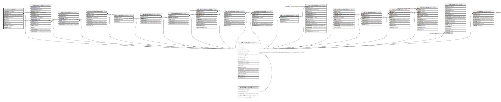

# ti.stewardupdates

## Description

## Columns

| # | Name        | Type                           | Default | Nullable | Children | Parents                         | Comment |
| - | ----------- | ------------------------------ | ------- | -------- | -------- | ------------------------------- | ------- |
| 1 | columnname  | varchar(64)                    |         | true     |          |                                 |         |
| 2 | contactid   | integer                        |         | false    |          | [ndb.contacts](ndb.contacts.md) |         |
| 3 | dateupdated | timestamp(0) without time zone |         | false    |          |                                 |         |
| 4 | operation   | varchar(24)                    |         | false    |          |                                 |         |
| 5 | pk1         | integer                        |         | true     |          |                                 |         |
| 6 | pk2         | integer                        |         | true     |          |                                 |         |
| 7 | pk3         | varchar(24)                    |         | true     |          |                                 |         |
| 8 | tablename   | varchar(64)                    |         | false    |          |                                 |         |
| 9 | updateid    | integer                        |         | false    |          |                                 |         |

## Viewpoints

| Name                                     | Definition                                                       |
| ---------------------------------------- | ---------------------------------------------------------------- |
| [Contact related tables](viewpoint-4.md) | Tables that relate to people, or are connected to the contactid. |

## Constraints

| # | Name                       | Type        | Definition                                                 |
| - | -------------------------- | ----------- | ---------------------------------------------------------- |
| 1 | fk_stewardupdates_contacts | FOREIGN KEY | FOREIGN KEY (contactid) REFERENCES ndb.contacts(contactid) |
| 2 | stewardupdates_pkey        | PRIMARY KEY | PRIMARY KEY (updateid)                                     |

## Indexes

| # | Name                | Definition                                                                          |
| - | ------------------- | ----------------------------------------------------------------------------------- |
| 1 | stewardupdates_pkey | CREATE UNIQUE INDEX stewardupdates_pkey ON ti.stewardupdates USING btree (updateid) |

## Triggers

| # | Name          | Definition                                                                                                                          |
| - | ------------- | ----------------------------------------------------------------------------------------------------------------------------------- |
| 1 | record_update | CREATE TRIGGER record_update BEFORE INSERT OR UPDATE ON ti.stewardupdates FOR EACH ROW EXECUTE FUNCTION ti.update_recdatemodified() |

## Relations

---

> Generated by [tbls](https://github.com/k1LoW/tbls)