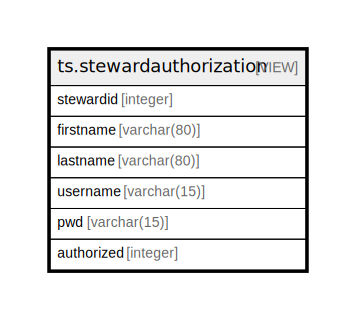

# ts.stewardauthorization

## Description

<details>
<summary><strong>Table Definition</strong></summary>

```sql
CREATE VIEW stewardauthorization AS (
 SELECT stewards.stewardid,
    contacts.givennames AS firstname,
    contacts.familyname AS lastname,
    stewards.username,
    stewards.pwd,
    stewarddatabases.databaseid AS authorized
   FROM ((ti.stewards
     JOIN ndb.contacts ON ((stewards.contactid = contacts.contactid)))
     JOIN ti.stewarddatabases ON ((stewards.stewardid = stewarddatabases.stewardid)))
)
```

</details>

## Columns

| # | Name       | Type        | Default | Nullable | Children | Parents | Comment |
| - | ---------- | ----------- | ------- | -------- | -------- | ------- | ------- |
| 1 | stewardid  | integer     |         | true     |          |         |         |
| 2 | firstname  | varchar(80) |         | true     |          |         |         |
| 3 | lastname   | varchar(80) |         | true     |          |         |         |
| 4 | username   | varchar(15) |         | true     |          |         |         |
| 5 | pwd        | varchar(15) |         | true     |          |         |         |
| 6 | authorized | integer     |         | true     |          |         |         |

## Referenced Tables

| # | # | Name                                          | Columns | Comment                                                                                                                                                                                     | Type       |
| - | - | --------------------------------------------- | ------- | ------------------------------------------------------------------------------------------------------------------------------------------------------------------------------------------- | ---------- |
| 1 | 1 | [ti.stewards](ti.stewards.md)                 | 7       |                                                                                                                                                                                             | BASE TABLE |
| 2 | 2 | [ndb.contacts](ndb.contacts.md)               | 17      | This table lists persons and organizations referenced by the Chronologies, Collectors, DatasetPIs, DatasetSubmissions, Projects, PublicationAuthors, SampleAnalysts, and SiteImages tables. | BASE TABLE |
| 3 | 3 | [ti.stewarddatabases](ti.stewarddatabases.md) | 2       |                                                                                                                                                                                             | BASE TABLE |

## Relations



---

> Generated by [tbls](https://github.com/k1LoW/tbls)