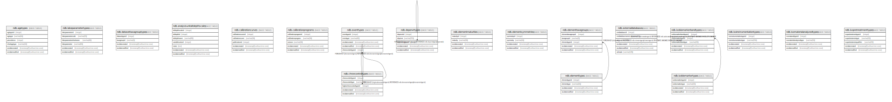

# Controlled Vocabularies

## Description

Tables with controlled vocabularies.

## Tables

| #  | Name                                                                | Columns | Comment                                                                                                    | Type       |
| -- | ------------------------------------------------------------------- | ------- | ---------------------------------------------------------------------------------------------------------- | ---------- |
| 1  | [ndb.agetypes](ndb.agetypes.md)                                     | 6       | Lookup table of Age Types or units. This table is referenced by the Chronologies and Geochronology tables. | BASE TABLE |
| 2  | [ndb.analysisunitaltdepthscales](ndb.analysisunitaltdepthscales.md) | 7       |                                                                                                            | BASE TABLE |
| 3  | [ndb.calibrationcurves](ndb.calibrationcurves.md)                   | 5       |                                                                                                            | BASE TABLE |
| 4  | [ndb.calibrationprograms](ndb.calibrationprograms.md)               | 5       |                                                                                                            | BASE TABLE |
| 5  | [ndb.chroncontroltypes](ndb.chroncontroltypes.md)                   | 5       | Lookup table of Chronology Control Types. This table is referenced by the ChronControls table.             | BASE TABLE |
| 6  | [ndb.datasettaxagrouptypes](ndb.datasettaxagrouptypes.md)           | 4       |                                                                                                            | BASE TABLE |
| 7  | [ndb.depenvttypes](ndb.depenvttypes.md)                             | 5       | Lookup table of Depositional Environment Types. Table is referenced by the CollectionUnits table.          | BASE TABLE |
| 8  | [ndb.elementmaturities](ndb.elementmaturities.md)                   | 4       |                                                                                                            | BASE TABLE |
| 9  | [ndb.elementsymmetries](ndb.elementsymmetries.md)                   | 4       |                                                                                                            | BASE TABLE |
| 10 | [ndb.elementtaxagroups](ndb.elementtaxagroups.md)                   | 5       |                                                                                                            | BASE TABLE |
| 11 | [ndb.elementtypes](ndb.elementtypes.md)                             | 4       |                                                                                                            | BASE TABLE |
| 12 | [ndb.eventtypes](ndb.eventtypes.md)                                 | 5       |                                                                                                            | BASE TABLE |
| 13 | [ndb.externaldatabases](ndb.externaldatabases.md)                   | 6       |                                                                                                            | BASE TABLE |
| 14 | [ndb.isobiomarkerbandtypes](ndb.isobiomarkerbandtypes.md)           | 5       |                                                                                                            | BASE TABLE |
| 15 | [ndb.isobiomarkertypes](ndb.isobiomarkertypes.md)                   | 4       |                                                                                                            | BASE TABLE |
| 16 | [ndb.isoinstrumentationtypes](ndb.isoinstrumentationtypes.md)       | 4       |                                                                                                            | BASE TABLE |
| 17 | [ndb.isomaterialanalyzedtypes](ndb.isomaterialanalyzedtypes.md)     | 4       |                                                                                                            | BASE TABLE |
| 18 | [ndb.isopretreatmenttypes](ndb.isopretreatmenttypes.md)             | 5       |                                                                                                            | BASE TABLE |
| 19 | [ndb.lakeparametertypes](ndb.lakeparametertypes.md)                 | 6       | A set of variables associated with lakes, including area, depth and volume.                                | BASE TABLE |

## Relations

---

> Generated by [tbls](https://github.com/k1LoW/tbls)
