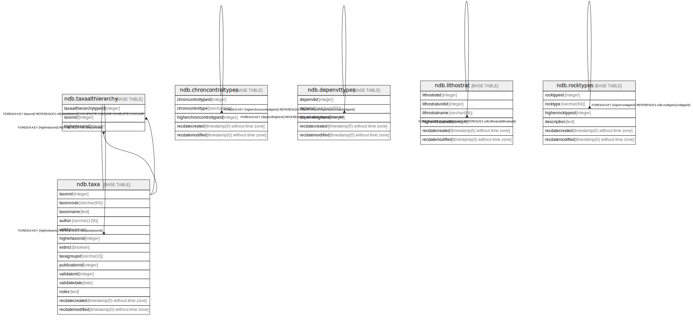

# Hierarchical Tables

## Description

Tables with internal hierarchies.

## Tables

| # | Name                                              | Columns | Comment                                                                                                                                          | Type       |
| - | ------------------------------------------------- | ------- | ------------------------------------------------------------------------------------------------------------------------------------------------ | ---------- |
| 1 | [ndb.taxa](ndb.taxa.md)                           | 14      | This table lists all taxa in the database. Most taxa are biological taxa; however, some are biometric measures and some are physical parameters. | BASE TABLE |
| 2 | [ndb.chroncontroltypes](ndb.chroncontroltypes.md) | 5       | Lookup table of Chronology Control Types. This table is referenced by the ChronControls table.                                                   | BASE TABLE |
| 3 | [ndb.depenvttypes](ndb.depenvttypes.md)           | 5       | Lookup table of Depositional Environment Types. Table is referenced by the CollectionUnits table.                                                | BASE TABLE |
| 4 | [ndb.lithostrat](ndb.lithostrat.md)               | 6       |                                                                                                                                                  | BASE TABLE |
| 5 | [ndb.rocktypes](ndb.rocktypes.md)                 | 6       |                                                                                                                                                  | BASE TABLE |
| 6 | [ndb.taxaalthierarchy](ndb.taxaalthierarchy.md)   | 3       |                                                                                                                                                  | BASE TABLE |

## Relations

---

> Generated by [tbls](https://github.com/k1LoW/tbls)
