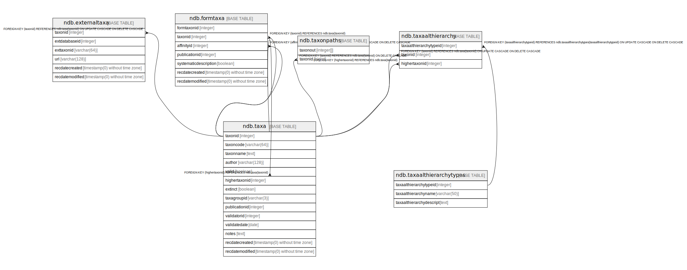

# Taxonomic Tables

## Description

Tables related to species, observations and specimens.

## Tables

| # | Name                                                      | Columns | Comment                                                                                                                                          | Type       |
| - | --------------------------------------------------------- | ------- | ------------------------------------------------------------------------------------------------------------------------------------------------ | ---------- |
| 1 | [ndb.taxa](ndb.taxa.md)                                   | 14      | This table lists all taxa in the database. Most taxa are biological taxa; however, some are biometric measures and some are physical parameters. | BASE TABLE |
| 2 | [ndb.externaltaxa](ndb.externaltaxa.md)                   | 6       |                                                                                                                                                  | BASE TABLE |
| 3 | [ndb.formtaxa](ndb.formtaxa.md)                           | 7       |                                                                                                                                                  | BASE TABLE |
| 4 | [ndb.taxaalthierarchy](ndb.taxaalthierarchy.md)           | 3       |                                                                                                                                                  | BASE TABLE |
| 5 | [ndb.taxaalthierarchytypes](ndb.taxaalthierarchytypes.md) | 3       |                                                                                                                                                  | BASE TABLE |
| 6 | [ndb.taxonpaths](ndb.taxonpaths.md)                       | 2       |                                                                                                                                                  | BASE TABLE |

## Relations

---

> Generated by [tbls](https://github.com/k1LoW/tbls)
