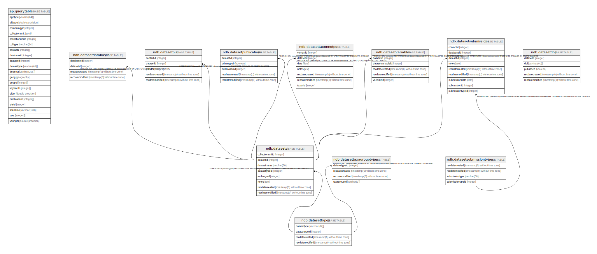

# Dataset related tables

## Description

Tables that help define and structure datasets.

## Tables

| #  | Name                                                        | Columns | Comment                                                                                                                                                                                                                                                                                                                                                                                                                                                                                                    | Type       |
| -- | ----------------------------------------------------------- | ------- | ---------------------------------------------------------------------------------------------------------------------------------------------------------------------------------------------------------------------------------------------------------------------------------------------------------------------------------------------------------------------------------------------------------------------------------------------------------------------------------------------------------- | ---------- |
| 1  | [ap.querytable](ap.querytable.md)                           | 20      |                                                                                                                                                                                                                                                                                                                                                                                                                                                                                                            | BASE TABLE |
| 2  | [ndb.datasetdatabases](ndb.datasetdatabases.md)             | 4       |                                                                                                                                                                                                                                                                                                                                                                                                                                                                                                            | BASE TABLE |
| 3  | [ndb.datasetdoi](ndb.datasetdoi.md)                         | 5       |                                                                                                                                                                                                                                                                                                                                                                                                                                                                                                            | BASE TABLE |
| 4  | [ndb.datasetpis](ndb.datasetpis.md)                         | 5       |                                                                                                                                                                                                                                                                                                                                                                                                                                                                                                            | BASE TABLE |
| 5  | [ndb.datasetpublications](ndb.datasetpublications.md)       | 5       | This table lists the publications for datasets.                                                                                                                                                                                                                                                                                                                                                                                                                                                            | BASE TABLE |
| 6  | [ndb.datasets](ndb.datasets.md)                             | 8       | This table stores the data for Datasets. A Dataset is the set of samples for a particular data type from a Collection Unit. A Collection Unit may have multiple Datasets for different data types, for example one dataset for pollen and another for plant macrofossils. Every Sample is assigned to a Dataset, and every Dataset is assigned to a Collection Unit. Samples from different Collection Units cannot be assigned to the same Dataset (although they may be assigned to Aggregate Datasets). | BASE TABLE |
| 7  | [ndb.datasetsubmissions](ndb.datasetsubmissions.md)         | 9       | Submissions to the database are of Datasets. Submissions may be original submissions, resubmissions, compilations from other databases, or recompilations. See the description of the DatasetSubmissionTypes table.                                                                                                                                                                                                                                                                                        | BASE TABLE |
| 8  | [ndb.datasetsubmissiontypes](ndb.datasetsubmissiontypes.md) | 4       | Lookup table of Dataset Submission Types. Table is referenced by the DatasetSubmissions table.                                                                                                                                                                                                                                                                                                                                                                                                             | BASE TABLE |
| 9  | [ndb.datasettaxagrouptypes](ndb.datasettaxagrouptypes.md)   | 4       |                                                                                                                                                                                                                                                                                                                                                                                                                                                                                                            | BASE TABLE |
| 10 | [ndb.datasettaxonnotes](ndb.datasettaxonnotes.md)           | 7       |                                                                                                                                                                                                                                                                                                                                                                                                                                                                                                            | BASE TABLE |
| 11 | [ndb.datasettypes](ndb.datasettypes.md)                     | 4       | Lookup table for Dataset Types. Table is referenced by the Datasets table.                                                                                                                                                                                                                                                                                                                                                                                                                                 | BASE TABLE |
| 12 | [ndb.datasetvariables](ndb.datasetvariables.md)             | 5       |                                                                                                                                                                                                                                                                                                                                                                                                                                                                                                            | BASE TABLE |

## Relations

---

> Generated by [tbls](https://github.com/k1LoW/tbls)
