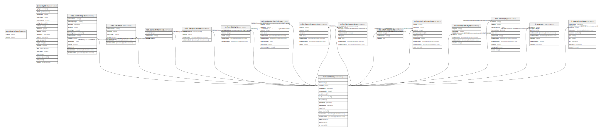

# Contact related tables

## Description

Tables that relate to people, or are connected to the contactid.

## Tables

| #  | Name                                                | Columns | Comment                                                                                                                                                                                                                                                                                                                                                                                                                                                                                                                                                                                                                                                                                                                                                                                                                                                                                                                                                                                                                                                                                                                                                                                                                                                                                                                                                                                                | Type       |
| -- | --------------------------------------------------- | ------- | ------------------------------------------------------------------------------------------------------------------------------------------------------------------------------------------------------------------------------------------------------------------------------------------------------------------------------------------------------------------------------------------------------------------------------------------------------------------------------------------------------------------------------------------------------------------------------------------------------------------------------------------------------------------------------------------------------------------------------------------------------------------------------------------------------------------------------------------------------------------------------------------------------------------------------------------------------------------------------------------------------------------------------------------------------------------------------------------------------------------------------------------------------------------------------------------------------------------------------------------------------------------------------------------------------------------------------------------------------------------------------------------------------ | ---------- |
| 1  | [ap.datasetpisauthors](ap.datasetpisauthors.md)     | 2       |                                                                                                                                                                                                                                                                                                                                                                                                                                                                                                                                                                                                                                                                                                                                                                                                                                                                                                                                                                                                                                                                                                                                                                                                                                                                                                                                                                                                        | VIEW       |
| 2  | [ap.querytable](ap.querytable.md)                   | 20      |                                                                                                                                                                                                                                                                                                                                                                                                                                                                                                                                                                                                                                                                                                                                                                                                                                                                                                                                                                                                                                                                                                                                                                                                                                                                                                                                                                                                        | BASE TABLE |
| 3  | [ndb.chronologies](ndb.chronologies.md)             | 13      | This table stores Chronology data. A Chronology refers to an explicit chronology assigned to a Collection Unit. A Chronology has Chronology Controls, the actual age-depth control points, which are stored in the ChronControls table. A Chronology is also based on an Age Model, which may be a numerical method that fits a curve to a set of age-depth control points or may simply be individually dated Analysis Units. A Collection Unit may have more than one Chronology, for example one in radiocarbon years and another in calibrated radiocarbon years. There may be a Chronology developed by the original author and another developed by a later research project. Chronologies may be stored for archival reasons, even though they are now believed to have problems, if they were used for an important research project. One Chronology per Age Type may be designated the default Chronology, which is the Chronology currently preferred by the database stewards. Based upon the Chronology, which includes the Age Model and the Chron Controls, ages are assigned to individual samples, which are stored in the SampleAges table. A younger and older age bounds are assigned to the Chronology. Within these bounds the Chronology is regarded as reliable. Ages may be assigned to samples beyond the reliable age bounds, but these are not considered reliable | BASE TABLE |
| 4  | [ndb.collectors](ndb.collectors.md)                 | 6       | The Collectors table lists the people who collected Collection Units.                                                                                                                                                                                                                                                                                                                                                                                                                                                                                                                                                                                                                                                                                                                                                                                                                                                                                                                                                                                                                                                                                                                                                                                                                                                                                                                                  | BASE TABLE |
| 5  | [ndb.contactreferences](ndb.contactreferences.md)   | 3       |                                                                                                                                                                                                                                                                                                                                                                                                                                                                                                                                                                                                                                                                                                                                                                                                                                                                                                                                                                                                                                                                                                                                                                                                                                                                                                                                                                                                        | BASE TABLE |
| 6  | [ndb.contacts](ndb.contacts.md)                     | 17      | This table lists persons and organizations referenced by the Chronologies, Collectors, DatasetPIs, DatasetSubmissions, Projects, PublicationAuthors, SampleAnalysts, and SiteImages tables.                                                                                                                                                                                                                                                                                                                                                                                                                                                                                                                                                                                                                                                                                                                                                                                                                                                                                                                                                                                                                                                                                                                                                                                                            | BASE TABLE |
| 7  | [ndb.dataprocessors](ndb.dataprocessors.md)         | 4       |                                                                                                                                                                                                                                                                                                                                                                                                                                                                                                                                                                                                                                                                                                                                                                                                                                                                                                                                                                                                                                                                                                                                                                                                                                                                                                                                                                                                        | BASE TABLE |
| 8  | [ndb.datasetpis](ndb.datasetpis.md)                 | 5       |                                                                                                                                                                                                                                                                                                                                                                                                                                                                                                                                                                                                                                                                                                                                                                                                                                                                                                                                                                                                                                                                                                                                                                                                                                                                                                                                                                                                        | BASE TABLE |
| 9  | [ndb.datasetsubmissions](ndb.datasetsubmissions.md) | 9       | Submissions to the database are of Datasets. Submissions may be original submissions, resubmissions, compilations from other databases, or recompilations. See the description of the DatasetSubmissionTypes table.                                                                                                                                                                                                                                                                                                                                                                                                                                                                                                                                                                                                                                                                                                                                                                                                                                                                                                                                                                                                                                                                                                                                                                                    | BASE TABLE |
| 10 | [ndb.datasettaxonnotes](ndb.datasettaxonnotes.md)   | 7       |                                                                                                                                                                                                                                                                                                                                                                                                                                                                                                                                                                                                                                                                                                                                                                                                                                                                                                                                                                                                                                                                                                                                                                                                                                                                                                                                                                                                        | BASE TABLE |
| 11 | [ndb.datataxonnotes](ndb.datataxonnotes.md)         | 7       |                                                                                                                                                                                                                                                                                                                                                                                                                                                                                                                                                                                                                                                                                                                                                                                                                                                                                                                                                                                                                                                                                                                                                                                                                                                                                                                                                                                                        | BASE TABLE |
| 12 | [ndb.externalcontacts](ndb.externalcontacts.md)     | 3       |                                                                                                                                                                                                                                                                                                                                                                                                                                                                                                                                                                                                                                                                                                                                                                                                                                                                                                                                                                                                                                                                                                                                                                                                                                                                                                                                                                                                        | BASE TABLE |
| 13 | [ndb.publicationauthors](ndb.publicationauthors.md) | 9       | This table lists authors as their names are given in publications. Only the initials are stored for authors’ given names. The ContactID links to the author’s full name and contact data in the Contacts table. Thus, for a bibliographic entry, Charles Robert Darwin is listed as C. R. Darwin, or as C. Darwin if the publication did not include his middle name. Book editors are also stored in this table if the entire book is cited. However, if a book chapter or section is cited, authors are stored in this table, but the book editors are stored in the PublicationEditors table. Thus, for the following reference, G. C. Frison is stored in the PublicationAuthors table. Frison, G. C., editor. 1996. The Mill Iron site. University of New Mexico Press, Albuquerque, New Mexico, USA. Whereas for the following publication, L. S. Cummings is listed in the PublicationAuthors table, and G. C. Frison is listed in the PublicationEditors table. Cummings, L. S. 1996. Paleoenvironmental interpretations for the Mill Iron site: stratigraphic pollen and phyrolith analysis. Pages 177-193 in G. C. Frison, editor. The Mill Iron site. University of New Mexico Press, Albuquerque, New Mexico, USA.                                                                                                                                                                | BASE TABLE |
| 14 | [ndb.sampleanalysts](ndb.sampleanalysts.md)         | 6       | This table lists the Sample Analysts.                                                                                                                                                                                                                                                                                                                                                                                                                                                                                                                                                                                                                                                                                                                                                                                                                                                                                                                                                                                                                                                                                                                                                                                                                                                                                                                                                                  | BASE TABLE |
| 15 | [ndb.synonymy](ndb.synonymy.md)                     | 11      | The synonymy table links dataset-level synonymies to particular publications or contacts.  This allows users to maintain the original taxonomic information within a table, but tie it to newer and more authoritative taxonomic information.                                                                                                                                                                                                                                                                                                                                                                                                                                                                                                                                                                                                                                                                                                                                                                                                                                                                                                                                                                                                                                                                                                                                                          | BASE TABLE |
| 16 | [ti.stewards](ti.stewards.md)                       | 7       |                                                                                                                                                                                                                                                                                                                                                                                                                                                                                                                                                                                                                                                                                                                                                                                                                                                                                                                                                                                                                                                                                                                                                                                                                                                                                                                                                                                                        | BASE TABLE |
| 17 | [ti.stewardupdates](ti.stewardupdates.md)           | 9       |                                                                                                                                                                                                                                                                                                                                                                                                                                                                                                                                                                                                                                                                                                                                                                                                                                                                                                                                                                                                                                                                                                                                                                                                                                                                                                                                                                                                        | BASE TABLE |

## Relations

---

> Generated by [tbls](https://github.com/k1LoW/tbls)
