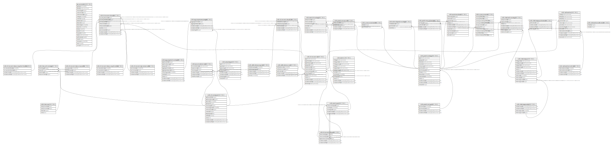

# Chronology related tables

## Description

Tables related to chronology and age assignments.

## Tables

| #  | Name                                                                              | Columns | Comment                                                                                                                                                                                                                                                                                                                                                                                                                                                                                                                                                                                                                                                                                                                                                                                                                                                                                                                                                                                                                                                                                                                                                                                                                                                                                                                                                                                                | Type       |
| -- | --------------------------------------------------------------------------------- | ------- | ------------------------------------------------------------------------------------------------------------------------------------------------------------------------------------------------------------------------------------------------------------------------------------------------------------------------------------------------------------------------------------------------------------------------------------------------------------------------------------------------------------------------------------------------------------------------------------------------------------------------------------------------------------------------------------------------------------------------------------------------------------------------------------------------------------------------------------------------------------------------------------------------------------------------------------------------------------------------------------------------------------------------------------------------------------------------------------------------------------------------------------------------------------------------------------------------------------------------------------------------------------------------------------------------------------------------------------------------------------------------------------------------------ | ---------- |
| 1  | [ap.querytable](ap.querytable.md)                                                 | 20      |                                                                                                                                                                                                                                                                                                                                                                                                                                                                                                                                                                                                                                                                                                                                                                                                                                                                                                                                                                                                                                                                                                                                                                                                                                                                                                                                                                                                        | BASE TABLE |
| 2  | [ndb.accumulationrates](ndb.accumulationrates.md)                                 | 6       |                                                                                                                                                                                                                                                                                                                                                                                                                                                                                                                                                                                                                                                                                                                                                                                                                                                                                                                                                                                                                                                                                                                                                                                                                                                                                                                                                                                                        | BASE TABLE |
| 3  | [ndb.aggregatechronologies](ndb.aggregatechronologies.md)                         | 10      | This table stores metadata for Aggregate Chronologies. An Aggregate Chronology refers to an explicit chronology assigned to a sample Aggregate. The individual Aggregate Samples have ages assigned in the AggregateSampleAges table. An Aggregate Chronology would be used, for example, for a set of packrat middens assigned to an AggregateDataset. The Aggregate Chronology is analogous to the Chronology assigned to samples from a single Collection Unit. An Aggregate may have more than one Aggregate Chronology, for example one in radiocarbon years and another in calibrated radiocarbon years. One Aggregate Chronology per Age Type may be designated the default, which is the Aggregate Chronology currently preferred by the database stewards.                                                                                                                                                                                                                                                                                                                                                                                                                                                                                                                                                                                                                                 | BASE TABLE |
| 4  | [ndb.aggregatesampleages](ndb.aggregatesampleages.md)                             | 5       | This table stores the links to the ages of samples in an Aggregate Dataset. The table is necessary because samples may be from Collection Units with multiple chronologies, and this table stores the links to the sample ages desired for the Aggregate Dataset.                                                                                                                                                                                                                                                                                                                                                                                                                                                                                                                                                                                                                                                                                                                                                                                                                                                                                                                                                                                                                                                                                                                                      | BASE TABLE |
| 5  | [ndb.calibrationcurves](ndb.calibrationcurves.md)                                 | 5       |                                                                                                                                                                                                                                                                                                                                                                                                                                                                                                                                                                                                                                                                                                                                                                                                                                                                                                                                                                                                                                                                                                                                                                                                                                                                                                                                                                                                        | BASE TABLE |
| 6  | [ndb.calibrationprograms](ndb.calibrationprograms.md)                             | 5       |                                                                                                                                                                                                                                                                                                                                                                                                                                                                                                                                                                                                                                                                                                                                                                                                                                                                                                                                                                                                                                                                                                                                                                                                                                                                                                                                                                                                        | BASE TABLE |
| 7  | [ndb.chroncontrolaccuracydirections](ndb.chroncontrolaccuracydirections.md)       | 4       |                                                                                                                                                                                                                                                                                                                                                                                                                                                                                                                                                                                                                                                                                                                                                                                                                                                                                                                                                                                                                                                                                                                                                                                                                                                                                                                                                                                                        | BASE TABLE |
| 8  | [ndb.chroncontrolaccuracydistributions](ndb.chroncontrolaccuracydistributions.md) | 4       |                                                                                                                                                                                                                                                                                                                                                                                                                                                                                                                                                                                                                                                                                                                                                                                                                                                                                                                                                                                                                                                                                                                                                                                                                                                                                                                                                                                                        | BASE TABLE |
| 9  | [ndb.chroncontrolaccuracyranks](ndb.chroncontrolaccuracyranks.md)                 | 4       |                                                                                                                                                                                                                                                                                                                                                                                                                                                                                                                                                                                                                                                                                                                                                                                                                                                                                                                                                                                                                                                                                                                                                                                                                                                                                                                                                                                                        | BASE TABLE |
| 10 | [ndb.chroncontrolprecisionranks](ndb.chroncontrolprecisionranks.md)               | 4       |                                                                                                                                                                                                                                                                                                                                                                                                                                                                                                                                                                                                                                                                                                                                                                                                                                                                                                                                                                                                                                                                                                                                                                                                                                                                                                                                                                                                        | BASE TABLE |
| 11 | [ndb.chroncontrolranks](ndb.chroncontrolranks.md)                                 | 9       |                                                                                                                                                                                                                                                                                                                                                                                                                                                                                                                                                                                                                                                                                                                                                                                                                                                                                                                                                                                                                                                                                                                                                                                                                                                                                                                                                                                                        | BASE TABLE |
| 12 | [ndb.chroncontrols](ndb.chroncontrols.md)                                         | 13      | This table stores data for Chronology Controls, which are the age-depth control points used for age models. These controls may be geophysical controls, such as radiocarbon dates, but include many other kinds of age controls, such as biostratigraphic controls, archaeological cultural associations, and volcanic tephras. In the case of radiocarbon dates, a Chronology Control may not simply be the raw radiocarbon date reported by the laboratory, but perhaps a radiocarbon date corrected for an old carbon reservoir, a calibrated radiocarbon date, or an average of several radiocarbon dates from the same level. A common control for lake-sediment cores is the age of the top of the core, which may be the year the core was taken or perhaps an estimate of 0 BP if a few cm of surficial sediment were lost.                                                                                                                                                                                                                                                                                                                                                                                                                                                                                                                                                                    | BASE TABLE |
| 13 | [ndb.chroncontrolscal14c](ndb.chroncontrolscal14c.md)                             | 5       |                                                                                                                                                                                                                                                                                                                                                                                                                                                                                                                                                                                                                                                                                                                                                                                                                                                                                                                                                                                                                                                                                                                                                                                                                                                                                                                                                                                                        | BASE TABLE |
| 14 | [ndb.chroncontroltypes](ndb.chroncontroltypes.md)                                 | 5       | Lookup table of Chronology Control Types. This table is referenced by the ChronControls table.                                                                                                                                                                                                                                                                                                                                                                                                                                                                                                                                                                                                                                                                                                                                                                                                                                                                                                                                                                                                                                                                                                                                                                                                                                                                                                         | BASE TABLE |
| 15 | [ndb.chronologies](ndb.chronologies.md)                                           | 13      | This table stores Chronology data. A Chronology refers to an explicit chronology assigned to a Collection Unit. A Chronology has Chronology Controls, the actual age-depth control points, which are stored in the ChronControls table. A Chronology is also based on an Age Model, which may be a numerical method that fits a curve to a set of age-depth control points or may simply be individually dated Analysis Units. A Collection Unit may have more than one Chronology, for example one in radiocarbon years and another in calibrated radiocarbon years. There may be a Chronology developed by the original author and another developed by a later research project. Chronologies may be stored for archival reasons, even though they are now believed to have problems, if they were used for an important research project. One Chronology per Age Type may be designated the default Chronology, which is the Chronology currently preferred by the database stewards. Based upon the Chronology, which includes the Age Model and the Chron Controls, ages are assigned to individual samples, which are stored in the SampleAges table. A younger and older age bounds are assigned to the Chronology. Within these bounds the Chronology is regarded as reliable. Ages may be assigned to samples beyond the reliable age bounds, but these are not considered reliable | BASE TABLE |
| 16 | [ndb.eventchronology](ndb.eventchronology.md)                                     | 7       |                                                                                                                                                                                                                                                                                                                                                                                                                                                                                                                                                                                                                                                                                                                                                                                                                                                                                                                                                                                                                                                                                                                                                                                                                                                                                                                                                                                                        | BASE TABLE |
| 17 | [ndb.events](ndb.events.md)                                                       | 12      |                                                                                                                                                                                                                                                                                                                                                                                                                                                                                                                                                                                                                                                                                                                                                                                                                                                                                                                                                                                                                                                                                                                                                                                                                                                                                                                                                                                                        | BASE TABLE |
| 18 | [ndb.eventtypes](ndb.eventtypes.md)                                               | 5       |                                                                                                                                                                                                                                                                                                                                                                                                                                                                                                                                                                                                                                                                                                                                                                                                                                                                                                                                                                                                                                                                                                                                                                                                                                                                                                                                                                                                        | BASE TABLE |
| 19 | [ndb.externalgeochronology](ndb.externalgeochronology.md)                         | 3       |                                                                                                                                                                                                                                                                                                                                                                                                                                                                                                                                                                                                                                                                                                                                                                                                                                                                                                                                                                                                                                                                                                                                                                                                                                                                                                                                                                                                        | BASE TABLE |
| 20 | [ndb.geochroncontrols](ndb.geochroncontrols.md)                                   | 4       |                                                                                                                                                                                                                                                                                                                                                                                                                                                                                                                                                                                                                                                                                                                                                                                                                                                                                                                                                                                                                                                                                                                                                                                                                                                                                                                                                                                                        | BASE TABLE |
| 21 | [ndb.geochronology](ndb.geochronology.md)                                         | 14      | This table stores geochronologic data. Geochronologic measurements are from geochronologic samples, which are from Analysis Units, which may have a depth and thickness. Geochronologic measurements may be from the same or different Analysis Units as fossils. In the case of faunal excavations, geochronologic samples are typically from the same Analysis Units as the fossils, and there may be multiple geochronologic samples from a single Analysis Unit. In the case of cores used for microfossil analysis, geochronologic samples are often from separate Analysis Units; dated core sections are often thicker than microfossil Analysis Units.                                                                                                                                                                                                                                                                                                                                                                                                                                                                                                                                                                                                                                                                                                                                         | BASE TABLE |
| 22 | [ndb.geochronpublications](ndb.geochronpublications.md)                           | 4       | Publications in which Geochronologic measurements are reported. Many older radiocarbon dates are reported in the journal Radiocarbon. Dates may be reported in multiple publications. The “publication” could be a database such as the online Canadian Archaeological Radiocarbon Database.                                                                                                                                                                                                                                                                                                                                                                                                                                                                                                                                                                                                                                                                                                                                                                                                                                                                                                                                                                                                                                                                                                           | BASE TABLE |
| 23 | [ndb.geochrontypes](ndb.geochrontypes.md)                                         | 4       | Lookup table for Geochronology Types. Table is referenced by the Geochronology table.                                                                                                                                                                                                                                                                                                                                                                                                                                                                                                                                                                                                                                                                                                                                                                                                                                                                                                                                                                                                                                                                                                                                                                                                                                                                                                                  | BASE TABLE |
| 24 | [ndb.hiatuschronology](ndb.hiatuschronology.md)                                   | 4       |                                                                                                                                                                                                                                                                                                                                                                                                                                                                                                                                                                                                                                                                                                                                                                                                                                                                                                                                                                                                                                                                                                                                                                                                                                                                                                                                                                                                        | BASE TABLE |
| 25 | [ndb.hiatuses](ndb.hiatuses.md)                                                   | 4       |                                                                                                                                                                                                                                                                                                                                                                                                                                                                                                                                                                                                                                                                                                                                                                                                                                                                                                                                                                                                                                                                                                                                                                                                                                                                                                                                                                                                        | BASE TABLE |
| 26 | [ndb.radiocarbon](ndb.radiocarbon.md)                                             | 12      |                                                                                                                                                                                                                                                                                                                                                                                                                                                                                                                                                                                                                                                                                                                                                                                                                                                                                                                                                                                                                                                                                                                                                                                                                                                                                                                                                                                                        | BASE TABLE |
| 27 | [ndb.radiocarboncalibration](ndb.radiocarboncalibration.md)                       | 2       | Radiocarbon calibration table. This table is intended for quick calibration of age-model radiocarbon dates. These calibrated dates are for perusal and data exploration only. Please see Section 2.5 for a full discussion.                                                                                                                                                                                                                                                                                                                                                                                                                                                                                                                                                                                                                                                                                                                                                                                                                                                                                                                                                                                                                                                                                                                                                                            | BASE TABLE |
| 28 | [ndb.radiocarbonmethods](ndb.radiocarbonmethods.md)                               | 4       |                                                                                                                                                                                                                                                                                                                                                                                                                                                                                                                                                                                                                                                                                                                                                                                                                                                                                                                                                                                                                                                                                                                                                                                                                                                                                                                                                                                                        | BASE TABLE |
| 29 | [ndb.relativeagepublications](ndb.relativeagepublications.md)                     | 4       | This table stores Publications in which Relative Ages are reported for CollectionUnits.                                                                                                                                                                                                                                                                                                                                                                                                                                                                                                                                                                                                                                                                                                                                                                                                                                                                                                                                                                                                                                                                                                                                                                                                                                                                                                                | BASE TABLE |
| 30 | [ndb.relativeages](ndb.relativeages.md)                                           | 11      | Lookup table of RelativeAges. Table is referenced by the RelativeChronology table.                                                                                                                                                                                                                                                                                                                                                                                                                                                                                                                                                                                                                                                                                                                                                                                                                                                                                                                                                                                                                                                                                                                                                                                                                                                                                                                     | BASE TABLE |
| 31 | [ndb.relativeagescales](ndb.relativeagescales.md)                                 | 4       | Lookup table of Relative Age Scales. Table is referenced by the RelativeAges table.                                                                                                                                                                                                                                                                                                                                                                                                                                                                                                                                                                                                                                                                                                                                                                                                                                                                                                                                                                                                                                                                                                                                                                                                                                                                                                                    | BASE TABLE |
| 32 | [ndb.relativechronology](ndb.relativechronology.md)                               | 7       | This table stores relative chronologic data. Relative Ages are assigned to Analysis Units, The Relative Age data along with any possible Geochronology and Tephrachronology data are used to create a chronology.                                                                                                                                                                                                                                                                                                                                                                                                                                                                                                                                                                                                                                                                                                                                                                                                                                                                                                                                                                                                                                                                                                                                                                                      | BASE TABLE |
| 33 | [ndb.sampleages](ndb.sampleages.md)                                               | 8       | This table stores sample ages. Ages are assigned to a Chronology. Because there may be more than one Chronology for a Collection Unit, samples may be assigned different ages for different Chronologies. A simple example is one sample age in radiocarbon years and another in calibrated radiocarbon years. The age units are an attribute of the Chronology.                                                                                                                                                                                                                                                                                                                                                                                                                                                                                                                                                                                                                                                                                                                                                                                                                                                                                                                                                                                                                                       | BASE TABLE |
| 34 | [ndb.specimendates](ndb.specimendates.md)                                         | 10      | This table enables queries for dated specimens of individual taxa. Although the MaterialDated field in the Geochronology table may list the taxa dated, this protocol is not enforced, and the field is not linked to the taxa table.                                                                                                                                                                                                                                                                                                                                                                                                                                                                                                                                                                                                                                                                                                                                                                                                                                                                                                                                                                                                                                                                                                                                                                  | BASE TABLE |
| 35 | [ndb.uraniumseries](ndb.uraniumseries.md)                                         | 10      |                                                                                                                                                                                                                                                                                                                                                                                                                                                                                                                                                                                                                                                                                                                                                                                                                                                                                                                                                                                                                                                                                                                                                                                                                                                                                                                                                                                                        | BASE TABLE |
| 36 | [ndb.uraniumseriesdata](ndb.uraniumseriesdata.md)                                 | 2       |                                                                                                                                                                                                                                                                                                                                                                                                                                                                                                                                                                                                                                                                                                                                                                                                                                                                                                                                                                                                                                                                                                                                                                                                                                                                                                                                                                                                        | BASE TABLE |

## Relations

---

> Generated by [tbls](https://github.com/k1LoW/tbls)
