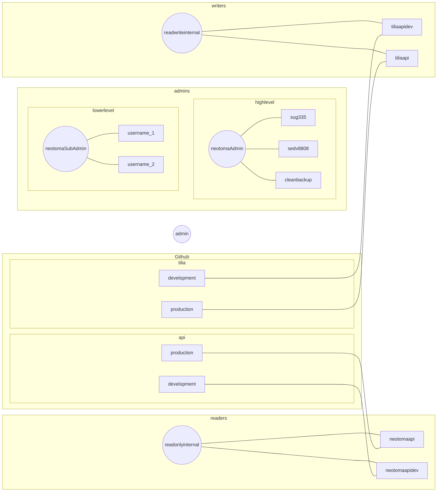

## Introduction

We implement a 'least permissions' approach to user management in Neotoma. This means that any Neotoma "user" has only the permissions they need to do their task, nothing more. This means there is a user hierarchy within the database. We have a primary, or root user, who is able to create new users, delete the database, change passwords, or any other function. From there we create users with access to subsets of the database, or with permissions only to read or to read/write on certain schema only.

## Application Specific Users

Postgres identifies a difference between a `user` and a `role`. A role defines the class of user, so for example, we might want to define a role that is "readonly", where that role has access to the database, but only to read. Because we have different applications using the database, often at the same time, but for different purposes, it is useful for us to see not only the `role`, but also the application that is using the services. For this, we can use specific `user`s, and assign them passwords to help improve security.

So, for example, we may have a `readonly` user from our Neotoma API (`apireader`) and a `readonly` user from a mapping application (`mapreader`). In this way if we are using a tool like `pg_stat_statements` we can see not only which queries are being run, but who is actually running the queries:

```sql
select pid.rolname, pss.dbid, pss.query, pss.mean_exec_time from pg_stat_statements as pss 
inner join pg_roles as pid on pid.oid = pss.userid
where dbid = 1661456
order by pss.mean_exec_time desc
limit 20;
```

Would give us a table that shows which users are responsible for the most time consuming queries. This would help us then either re-factor the queries, or work to improve the application so that it can make more efficient use of query planning, or execution.

## User Hierarchy



These sets of users provide the backbone for database use. If we have power users who are potentially developing elements for the Neotoma API, they should primarily use database snapshots, as provided by the [`clean_backup`]() code repository.

For all "users" with login permissions (as opposed to the roles from which they inherit permissions), we define login passwords seperately (replacing the `testlogin` password). The usernames and passwords should be set either using GitHub repository level secrets, or in local `.env` files.
